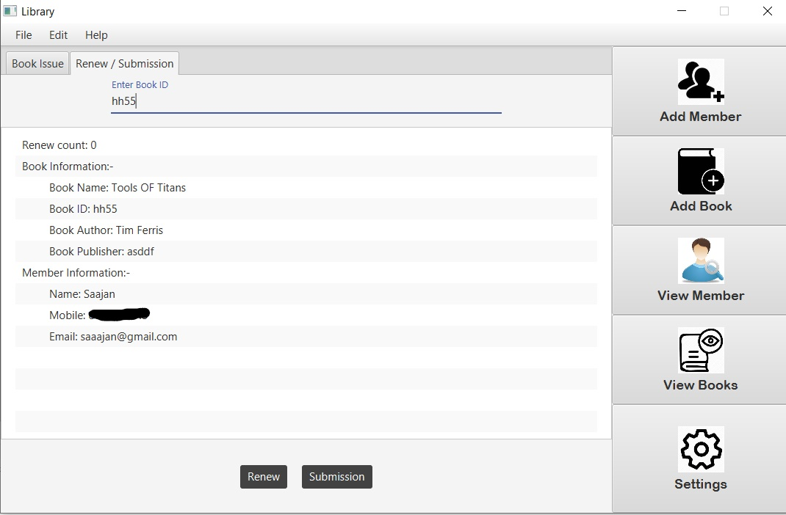

# College-Management-System

This is a JavaFX project based on computer vision, networking and DBMS. It allows the user(college faculty or librarian) to perform their tasks more efficiently. 

**The college faculty can perform the following:**
1. CRUD operations on students data.
2. Facial recognition based attendance system.
3. Chat with students.

**The librarian can perform the following**
1. CRUD operation on books data.
2. CRUD operation on the members data of the library.
3. Issuing the book.
4. Renewing the book.
5. Submission of book.

### About

* Facial detection is done using haar cascade classifier algorithm and facial recognition is done using lbph algorithm.
* The chatting module is implemented using java socket programming where the faculty is the server socket and student is the client socket.
* The project uses sqlite database and JDK 1.8.0_121.

### Snapshots

     

      

